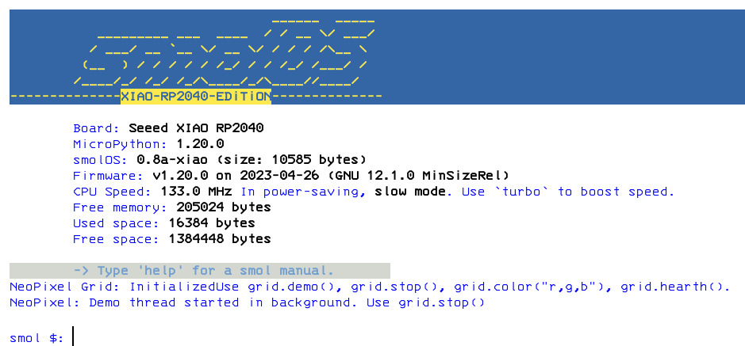
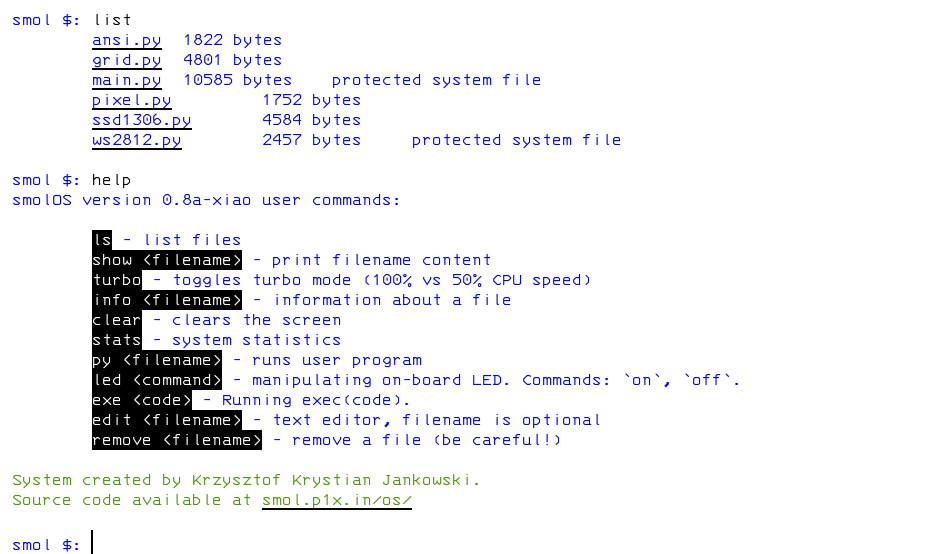
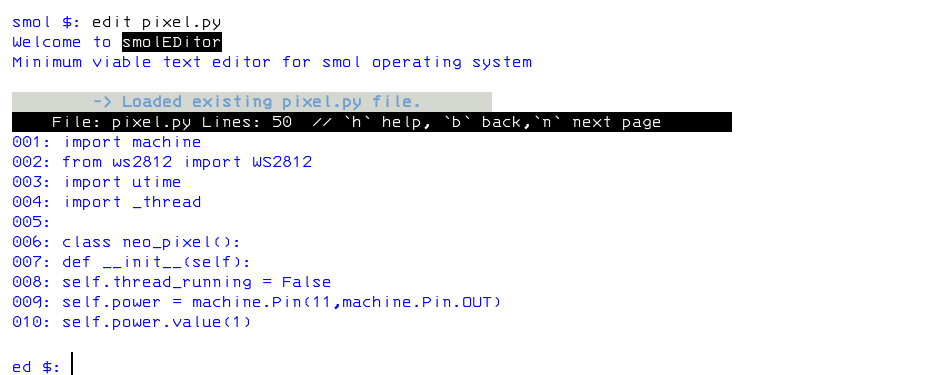

# smolOS
## Specialized Microcontroller-Oriented Lightweight Operating System

smolOS is a tiny and simple operating system for MicroPython giving the user POSIX-like environment to play and research. It came with a set of tools and demos.
System should run on any MicroPython supproted board but it's tested and developed for XIAO RP2040,

## Latest documentation available at official homepage:
- [smolOS homepage (http)](http://smol.p1x.in/os/)
- [smolOS homepage (https)](https://smol.p1x.in/os/)

## Screens




## Real Life Usecases

* listing and removing unwanted files on board
* checking free space
* quicly iterating parameters for a program
* learning basics of disk operating system
* having fun with microcontrollers

## smolOS Features

* Changes microcontroller into a small working PC
* Homemade for fun and learning
* Super small and fast
* Easy to use, simillar to MS-DOS, POSIX-like environments
* List and manipulates files
* Text editor included (very basic)
* Basic tools and demos included (for NeoPixels, Buzzers, LEDs)
* Build on MicroPython with clear code
* Stability and simplicity are the main principle behind the code
* Free and open :)

## Installation

### Super Quick Quide
Just put main system file (smolos.py) onto the board flash (that has latest MicroPython firmware) and restart.
* for auto boot rename the file to ```main.py``` it will auto start at each boot, or
* keep ```smolos.py``` name for manual booting

### Detailed Guides
* [XIAO RP2040 Guide](docs/XIAO-RP2040.md)
* [ESP8266 Guide](docs/ESP8266.md)

## Connecting
As normal user:

```
$ picocom /dev/ttyACM0
```
Press ```ctrl+a+x``` to exit.

## Running

First start. Or after flashing new main.py file. Restart the microcontroller:
```
>>> machine.soft_reset()
```

### Autoboot
This should restart the device and "boot" you into the smolOS. Like so:


### Manual
If you put ```smolos.py``` then you need to boot the system by hand.
In MicroPython REPL write:
```
>>> from smolos import smolOS
>>> os = smolOS()
>>> os.boot()
```

## Using

Write `help` for manual :)

## Missing Features
Some kind of a roadmap.
- move/copy files
- saving in editor
- code refactoring and tools unification
- good manual


## Articles
- [hackster.io](https://www.hackster.io/news/krzysztof-jankowski-s-micropython-based-smolos-puts-a-tiny-posix-like-environment-on-your-esp8266-0c776559152b)
- [cnx-software.com](https://www.cnx-software.com/2023/07/12/smolos-brings-a-linux-like-command-line-interface-to-esp8266-microcontroller/)
- [lobste.rs](https://lobste.rs/s/ipztxc/smolos_small_os_for_micropython_on)

## Intresting forks
- [pegasusOS by 047pegasus](https://github.com/047pegasus/pegasusOS)
- [smolOS by rbenrax](https://github.com/rbenrax/smolOS)
