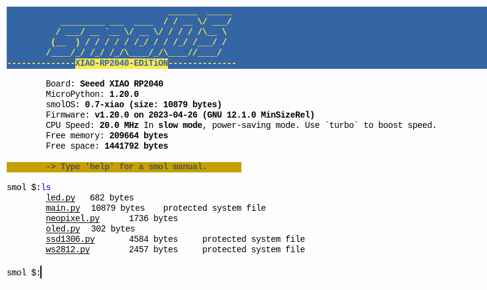
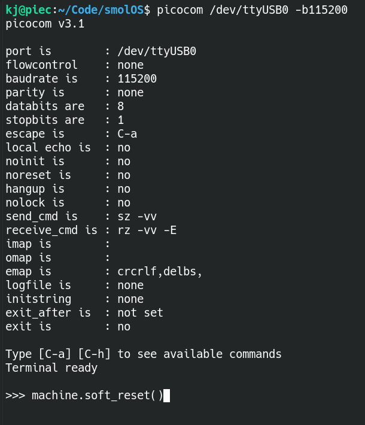
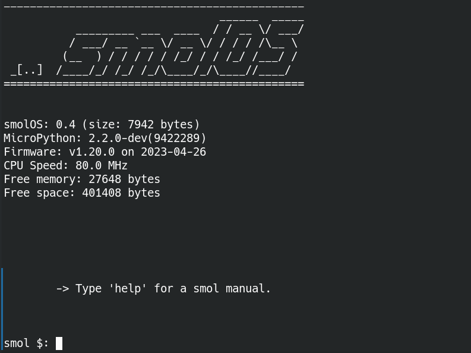
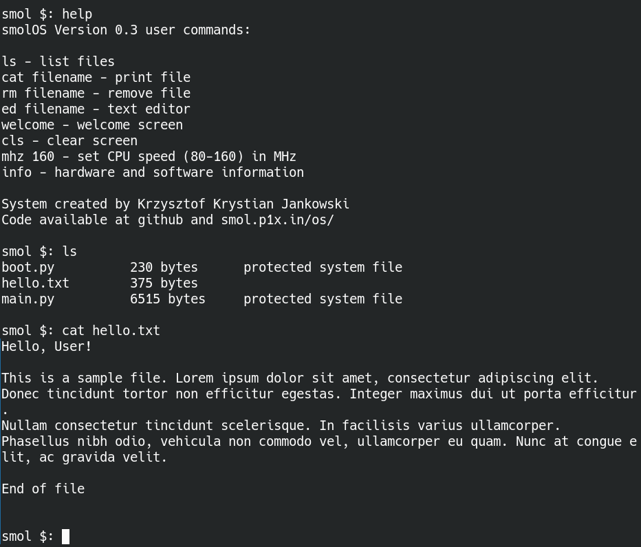

# smolOS

smolOS - a tiny and simple operating system for MicroPython (targetting ESP8266 and RP2040) giving the user POSIX-like environment to play.




Latest documentattion available at official homepage:
- [smolOS homepage (http)](http://smol.p1x.in/os/)
- [smolOS homepage (https)](https://smol.p1x.in/os/)


## smolOS Features

* Changes ESP8266 into a small working PC
* Homemade for fun and learning
* Super small and fast
* Easy to use, simillar to MS-DOS, POSIX-like environment
* List and manipulates files
* Text editor included (basic)
* Ability to view and edit the OS code in runtime
* Build on MicroPython

## Install
### Requiments
```
$ python3 -m venv venv
$ source venv/bin/activate
$ pip install esp-tool adafruit-ampy
```

### Flashing MicroPython on ESP8266
Remember to ground PIN 0 for flash mode. I've added a push button to the UART-to-USB dongle for that. I then push it while plugging in.

Get the latest firmware from [MicroPython Download Page for ESP8266 1MB](https://micropython.org/download/esp8266-1m/). That's the chip I got.

In the time of writeing this was the latest file: esp8266-1m-20230426-v1.20.0.bin.

As super user.

```
$ su
$ esptool.py chip_id
$ esptool.py --port /dev/ttyUSB0 erase_flash
$ esptool.py --port /dev/ttyUSB0 --baud 115200 write_flash --flash_size=detect -fm dout 0 esp8266-1m-20230426-v1.20.0.bin
```

- chip_id lists specs and confirms that everything works
- erase_flash clears everything
- write_flash flashes the MicroPython firmware

### pushing OSs
**Rename downloaded sources to main.py**
```
$ ampy --port /dev/ttyUSB0 put main.py
$ ampy --port /dev/ttyUSB0 put hello.txt
```
- main.py is the smolOS, this file name will run at boot
- hello.txt is just a test file so you have something to play with
- put your own files the same way
- **do not** ovevrite the system boot.py file!

## Connecting
As normal user:

```
$ picocom /dev/ttyUSB0 -b115200
```
Press ```ctrl+a+x``` to exit.

## Running


First start. Or after flashing new main.py file. Restart the microcontroller:
```
>>> machine.soft_reset()
```

This should restart the device and "boot" you into the smolOS. Like so:

```


______________________________________________
                                 ______  _____
           _________ ___  ____  / / __ \/ ___/
          / ___/ __ `__ \/ __ \/ / / / /\__ \
         (__  ) / / / / / /_/ / / /_/ /___/ /
 _[..]  /____/_/ /_/ /_/\____/_/\____//____/
==============================================

       smolOS Version 0.3
       MicroPython: 2.2.0-dev(9422289)
       Firmware: v1.20.0 on 2023-04-26
       CPU Speed: 80.0 MHz


smolInfo: Type [help] for smol manual.


smol $:
```




In MicroPython REPL write:
```
>>> smolOS()
```

## Using


Write `help` for help :)

### Example user session


### smolEDitor
First application: `ed`! Almost complete but very simple text editor.


## Articles
- [hackster.io](https://www.hackster.io/news/krzysztof-jankowski-s-micropython-based-smolos-puts-a-tiny-posix-like-environment-on-your-esp8266-0c776559152b)
- [cnx-software.com](https://www.cnx-software.com/2023/07/12/smolos-brings-a-linux-like-command-line-interface-to-esp8266-microcontroller/)
