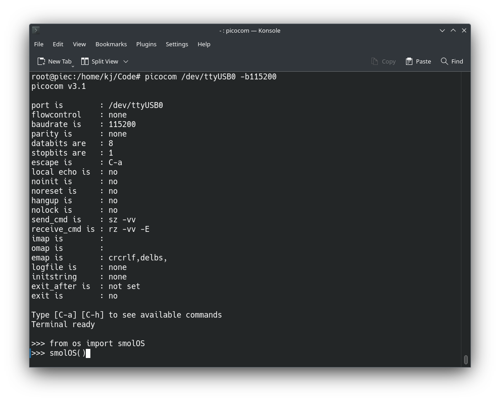
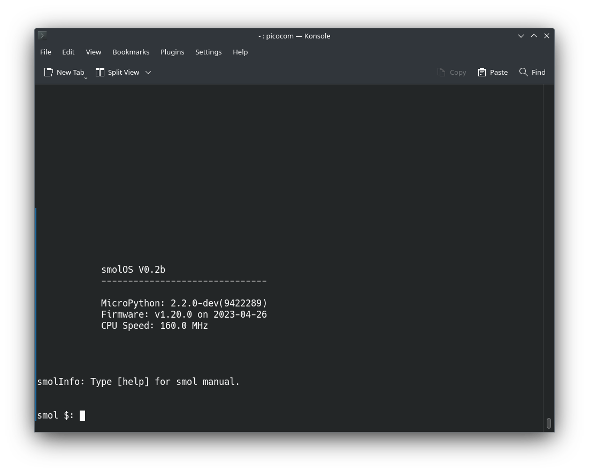
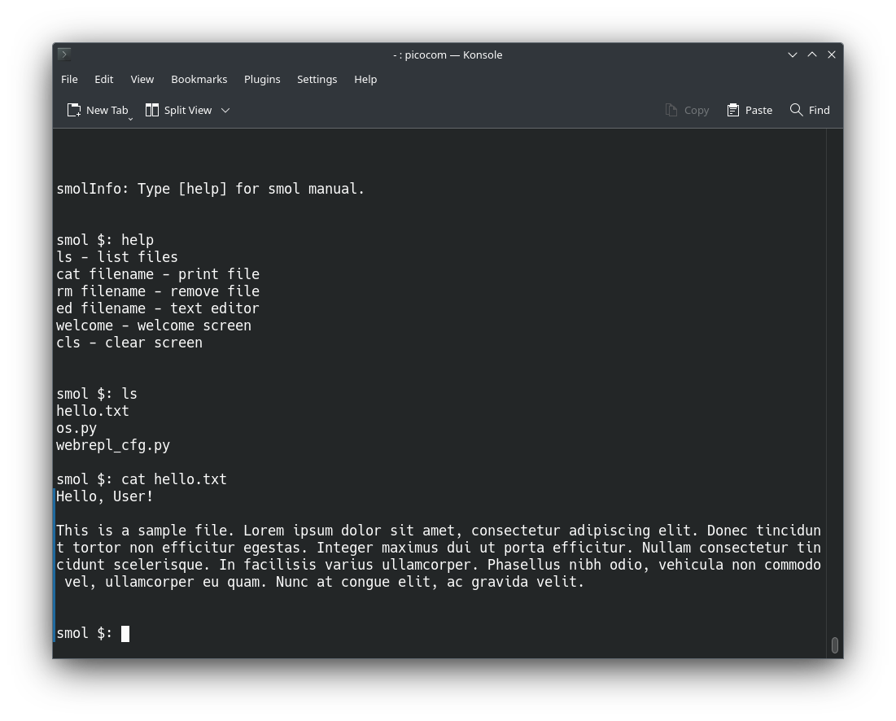

# smolOS
smolOS for MicroPython (ESP8266)

## Install
### Requiments
```
$ python3 -m venv venv
$ source venv/bin/activate
$ pip install adafruit-ampy
```

### Flashing MicroPython on ESP8266
Remember to ground PIN 0 for flash mode.

```
$ esptool.py chip_id
$ esptool.py --port /dev/ttyUSB0 --baud 115200 write_flash --flash_size=detect -fm dout 0 esp8266-1m-20230426-v1.20.0.bin
```

### pushing OS
```
$ ampy --port /dev/ttyUSB0 put os.py
```

### Connecting
```
$ picocom /dev/ttyUSB0 -b115200
```

Press ```ctrl+a+x``` to exit.

## Running


In MicroPython REPL write:
```
from os import smolOS
smolOS()
```

## Using


Write help for help :)

### Example session

